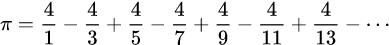

# Задачи за упражнение

## Задача 1
Дефинирайте функцията `void greet(int times)` която изпринтира текста `Hello, World!` на екрана `times` на брой пъти. Ако `times` е отрицателно число функцията да изпринтира текста само веднъж. Демонстрирайте използването на функцията в главната функция на програмата.


## Задача 2
Дефинирайте функцията `float cel_to_fah(float celsius)` която преобразува температура от целзии във фаренхайт. Функцията трябва да _върне_ като резултат получената температура, а не да принтира на екрана. Демонстрирайте коректността на функцията в главната функция на програмата със следните примери.

### Примери
Очакваните стойности са приблизителни, възможно е леко разминаване при принтирането на екрана.
```c
cel_to_fah(0);          // expected result: 32
cel_to_fah(-32);        // -25.6
cel_to_fah(-17.77778);  // 0
cel_to_fah(36.6);       // 97.88
```


## Задача 3
Дефинирайте функцията `float average_odds(int a, int b)` която пресмята и връща като резултат средно аритметичното на нечетните числа в интервала `[a;b]` (включително `a` и `b`). Ако `a > b` функцият да връща стойност `0`.
Демонстрирайте коректността на функцията в главната функция със следните примери.

### NB
Функцията трябва да работи коректно и с интервали с отрицателни числа, например [-3;-1].

### Примери
```c
average_odds(-3, -1);    // -2
average_odds(1, 3);      // 2
average_odds(2, 2);      // 0
average_odds(-15, -15);  // -15
average_odds(5, 10);     // 7
average_odds(-7, -3);    // -5
average_odds(-20, 20);   // 0
average_odds(1, 100);    // 50
```


## Задача 4
Дефинирайте функцията `float calc_binary_op(char operator, float operand1, float operand2)` която пресмята и връща като резултат на функцията стойността от изпълнението на оператора `operator` приложен върху операндите `operand1` и `operand2`. Възможните оператори са `'+'`, `'-'`, `'*'`, `'/'` – събиране, изваждане, умножение и деление.

Ако операторът е деление и вторият операнд има стойност `0.0` функцията да върне `0.0` като резултат.

Ако функцията е извикана с непознат оператор, функцията трябва да върне 0.

Демонстрирайте коректността на функцията в главната функция на програмата със следните примери.

### Примери
```c
calc_binary_op('+', -1, 2);    // 1
calc_binary_op('-', 1, 2);     // -1
calc_binary_op('-', 2, 1);     // 1
calc_binary_op('*', 2, -2);    // -4
calc_binary_op('/', 25.5, 4);  // 6.375
calc_binary_op('/', 3.14, 0);  // 0
calc_binary_op('i', 2, 200);   // 0
```


## Задача 5
Дефинирайте функцията `int is_prime(int n)`, която връща като резултат 1 ако параметърът `n` е просто число, или 0 ако не е просто.
Дефинирайте функцията `void twin_primes(int a, int b)` която принтира на екрана двойките прости числа с разлика 2 помежду си, които попадат в интервала `[a;b]`. За реализацията на тази функция правете извикване към функцията `is_prime`.

Демонстрирайте коректността на функцията в главната функция на програмата със следните примери.

### Примери
```c
twin_primes(1, 10);    // (3, 5), (5, 7)
twin_primes(17, 101);  // (17, 19), (29, 31), (41, 43), (59, 61), (71, 73)
twin_primes(19, 31);   // (29, 31)
```


## Задача 6
Дефинирайте функцията `double leibniz_pi(int iterations)`, която пресмята и връща като резултат математическата константа *pi* използвайки формулата на Лайбниц, която има следния вид:



### NB
Обърнете внимание на редуването на знаците при всяка операция.

Параметърът `iterations` показва колко пъти да извършим повтарящата се операция преди функцията да върне резултат. Колкото по-голяма стойност има този параметър толкова по-точно приближение ще получим.

Демонстрирайте коректността на функцията в главната функция на програмата със следните примери.

### NB2:
За да не губите точност при изчисленията за локални променливи във функцията използвайте тип _double_ вместо _float_.

За изпринтиране на резултата от функцията използвайте `%lf` във форматиращия стринг на `printf`.

### Примери

```c
leibniz_pi(1);         // 4.000000
leibniz_pi(10);        // 3.041840
leibniz_pi(100);       // 3.131593
leibniz_pi(1000);      // 3.140593
leibniz_pi(10000);     // 3.141493
leibniz_pi(100000);    // 3.141583
leibniz_pi(1000000);   // 3.141592
